# polymarket-companion

A lean, personal Polymarket **analysis and trade-companion** system — not an
automatic trading bot. It discovers relevant markets, filters and scores
them deterministically, uses an LLM only on a small shortlist, alerts over
Telegram, and tracks paper-trading performance honestly before any live
trading is ever considered.

**Status: Stage 2 (discovery + feature/probability/edge/risk-gate/scoring
pipeline, narrowed to three target market families, deployable via
systemd).** LLM analysis, Telegram, paper trading, and performance tracking
are not built yet — see [Roadmap](#roadmap).

## Why this exists

Polymarket lists thousands of markets. Sending all of them to an LLM is
slow, expensive, and unnecessary — most are irrelevant or low quality. This
project runs a **multi-stage pipeline**: cheap, deterministic filtering
narrows thousands of markets down to a handful of high-quality candidates
*before* any LLM call happens, and every trading decision must be able to
say **NO TRADE**.

```mermaid
flowchart LR
    A[Polymarket Gamma/CLOB APIs] --> B[Market Discovery]
    B --> C[Category + Quality Filters]
    C --> D[Feature Engineering]
    D --> E[Probability / Edge Engine]
    E --> F[Shortlist]
    F --> G[LLM Deep Analysis]
    G --> H[Telegram Alert]
    H --> I[Paper Trade]
    I --> J[Outcome + Performance DB]
    J -.improves.-> D

    style A fill:#e8e8e8,stroke:#888
    style B fill:#cfe8ff,stroke:#4a90d9
    style C fill:#cfe8ff,stroke:#4a90d9
    style D fill:#d9f2d9,stroke:#4caf50
    style E fill:#d9f2d9,stroke:#4caf50
    style F fill:#ffe9b3,stroke:#e0a800
    style G fill:#ffe0e0,stroke:#e05a5a
    style H fill:#e0d9ff,stroke:#8a6de0
    style I fill:#e0d9ff,stroke:#8a6de0
    style J fill:#e8e8e8,stroke:#888
```



**Stage 1 currently implements the first two boxes**: Market Discovery and
Category + Quality Filters (plus persistence), shown in blue above.

## Market price vs. model probability

A core principle of this project: **the current market price is not treated
as ground truth**. It's one signal among several. Stage 1 stores Gamma's
`bestBid`/`bestAsk`/`outcomePrices` purely as **discovery-time metadata** —
useful for filtering and ranking candidates, but explicitly *not* an
executable/tradable price. Once a scoring stage exists, tradable
price/spread/depth must come from the CLOB order book (`/book`, `/price`),
which is the authoritative source Polymarket itself uses for execution.

## Architecture (current)

```
app/
  config/loader.py       # AppConfig from config/*.yaml + .env
  polymarket/
    client.py             # httpx wrapper: timeouts, retry/backoff, rate limiting
    categorize.py          # keyword/entity -> (category, subcategory)
    markets.py              # pagination, extraction, filtering, dedup-flagging
    scanner.py                # one-shot orchestrator (fetch -> ... -> persist)
  storage/
    models.py              # Market: normalizes raw Gamma dicts safely
    database.py              # SQLite schema (markets, market_snapshots)
    repositories.py            # parameterized read/write access
config/
  profile.yaml            # non-secret tunables: filters, discovery, http, logging
  markets.yaml              # category/subcategory keyword rules
data/polymarket.db        # SQLite (gitignored)
scripts/smoke_test.py     # manual, read-only live API check
main.py                   # CLI: `scan`, `initdb`
```

## Data sources

Three public, **keyless** Polymarket REST APIs are used — no wallet, API key,
or order-signing is needed anywhere in this project, since it never places
live orders:

- **Gamma API** (`gamma-api.polymarket.com`) — market/event discovery and
  metadata. Used for the Stage 1 discovery pipeline.
- **CLOB REST, read-only** (`clob.polymarket.com`) — order book / price /
  price history. Only used for a connectivity check in
  `scripts/smoke_test.py` today; becomes the authoritative price source once
  a feature/scoring stage exists.
- **Data API** (`data-api.polymarket.com`) — positions/trades/activity. Not
  used yet; reserved for later stages.

Polymarket cut over its trading infrastructure to **CLOB V2 on
2026-04-28**, which archived the old `py-clob-client` Python package for
order signing. This project sidesteps that entirely by never signing
orders — it only calls the public read-only REST endpoints directly via
`httpx`.

> **Verification note:** direct access to `docs.polymarket.com` and the
> live Polymarket APIs was blocked by this development environment's
> network egress policy while this was built. The API surface above was
> cross-checked via Polymarket's own GitHub repos (`agent-skills`,
> `agents`, `py-clob-client`, `py-sdk`) and current secondary sources, but
> has **not yet been confirmed against a live response**. Run
> `python scripts/smoke_test.py` from an environment with normal internet
> access before relying on this in production — it will print the raw
> response shape and flag anything that doesn't match the assumptions
> baked into `markets.py`/`models.py`.

## Setup

```bash
python3.12 -m venv .venv
source .venv/bin/activate
pip install -r requirements-dev.txt   # includes requirements.txt
```

No secrets are needed for Stage 1 — see `.env.example`.

## Usage

```bash
python main.py initdb   # create data/polymarket.db schema
python main.py scan     # run one discovery cycle, prints a ScanSummary
python main.py analyze  # run features->quality gate->probability->edge->risk gate->scoring->classification
```

`analyze` only considers the three target `(category, subcategory)` pairs
configured in `config/profile.yaml`'s `target_subcategories` (see
[Architecture](#architecture-current)) - see [Deployment](#deployment) to
run both commands automatically on a schedule instead of by hand.

## Tests

```bash
pytest
```

All 233 tests run against mocked HTTP responses (via `respx`), stubs, or an
in-memory temp SQLite file — no network access required.

## Live smoke test

```bash
python scripts/smoke_test.py
```

Read-only and safe to re-run: writes to `data/smoke_test.db` (never the real
DB), dumps the raw Gamma response so field-name assumptions can be
double-checked, runs the full discovery pipeline, and makes one CLOB
`/price` call to confirm CLOB reachability. No orders are ever placed.

## Deployment

`scan`, `analyze`, and `resolve` are one-shot commands - useful history only
accumulates if something keeps running them. `deploy/` has a systemd
service+timer for that; `scripts/setup.sh` installs them.

**Install** (as root, on the VPS - paths in the unit files assume the repo
lives at `/root/tronik`; edit `deploy/*.service`/`deploy/*.timer` first if
that's not where it's checked out):

```bash
sudo bash scripts/setup.sh
```

This copies the unit files to `/etc/systemd/system/`, reloads systemd, and
enables+starts the timer. It runs `scan`, then `analyze`, then `resolve`
every 15 minutes (`OnUnitActiveSec` in `deploy/polymarket-companion.timer`
- matches `filters.scan_interval_seconds`'s default in `config/profile.yaml`,
though the two aren't linked automatically; update both if you change the
interval).

**Check it's running:**

```bash
systemctl list-timers polymarket-companion.timer   # next/last firing
journalctl -u polymarket-companion.service -f      # live logs
```

**Update:** `git pull` - no restart needed, the next scheduled run picks up
the new code automatically.

**Backup:** SQLite's own backup command, not a raw file copy (the DB may be
mid-write):

```bash
sqlite3 data/polymarket.db ".backup data/polymarket-backup-$(date +%F).db"
```

**Uninstall:**

```bash
sudo systemctl disable --now polymarket-companion.timer
sudo rm /etc/systemd/system/polymarket-companion.{service,timer}
sudo systemctl daemon-reload
```

`analyze` makes a live CLOB `/book` call per candidate market that passes
the data quality gate, and `resolve` makes a Gamma `/markets` call per
not-yet-resolved market in `analyses`, so this cadence means recurring
Gamma/CLOB traffic roughly every 15 minutes indefinitely - `scan`, `analyze`,
and `resolve` are coupled on the same timer for simplicity; splitting them
onto independent intervals is a small follow-up if that traffic ever needs
tuning down. `resolve`'s per-run cost naturally shrinks over time since it
only ever looks at markets not already marked resolved.

## Design principles

- **Filtering never discards data.** Every discovered market is persisted;
  `filter_markets` only sets a `filter_reason` (e.g. `low_liquidity`,
  `wide_spread`, `closed`, `duplicate`) so later stages can revisit the
  decision instead of silently losing data.
- **Categorization never drops a market either.** Anything not matching a
  target keyword rule is stored as `category="other"`,
  `subcategory="uncategorized"` rather than being excluded.
- **Category rules live in YAML, not Python.** `config/markets.yaml` can be
  extended with more classification rules without touching code. What
  actually gets analyzed is a separate, narrower allowlist -
  `target_subcategories` in `config/profile.yaml` - currently exactly three
  families: politics/elon_musk_tweets, politics/white_house_tweets,
  crypto/btc_up_down. The two politics rules are deliberately posting/tweet-
  context only (e.g. "White House tweet about X?") - a market merely
  mentioning "White House" or "Elon Musk" (press secretary appointments,
  CEO news, etc.) does not match. Sports/basketball was removed from the
  target allowlist (scope reduction); its categorize rule is still defined
  in `config/markets.yaml` but is no longer analyzed.
- **No heavyweight infrastructure.** SQLite, no Docker/Kubernetes/Redis/
  Postgres, designed to run comfortably on a ~2GB VPS.

## Roadmap

Stage 1 (this stage) covers environment/API verification, project setup,
market discovery, categorization, filtering, normalization, and minimal
persistence. Not yet built: feature engineering, the probability/edge
engine, trade scoring and classification, selective LLM analysis, Telegram
alerts, paper trading, performance tracking, backtesting, and systemd
deployment — each is a separate planned stage, in that order.
